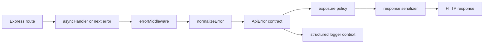

# Architecture

## Purpose

`@erangamadhushan/express-advanced-error-kit` provides a small, framework-specific error boundary for Express applications. It converts thrown values into stable HTTP responses while allowing applications to keep domain errors in their own code.

The package is not an application framework. It owns error contracts, normalization, response serialization, and Express integration; it does not own persistence, validation, authentication, or logging infrastructure.

## Current Repository Baseline

This documentation branch is based on the pre-Phase-2 implementation. The current committed middleware still performs MongoDB and Zod recognition inside `errorMiddleware`, and the current package metadata does not yet contain the conditional exports and peer-dependency changes described in the later package-quality phase.

The decisions below define the target architecture that subsequent implementation branches must preserve. The contract fixtures in `__tests__/contract` protect the behavior that already exists in this checkout while the target architecture is brought back into alignment.

## Request Flow

The target flow separates recognition from transport concerns:

1. Express supplies an unknown thrown value.
2. `normalizeError` applies user adapters before built-in adapters.
3. An `ApiError`-compatible contract is produced.
4. Exposure policy decides whether the message and stack may leave the process.
5. A serializer creates the legacy or problem-details response.
6. The logger receives the original normalized error and request context.

## Ownership Boundaries

| Area | Owner | Invariant |
| --- | --- | --- |
| Domain error creation | `ApiError`, predefined errors, `createError` | Status and code are explicit and stable. |
| Error recognition | Adapter registry | Adapters return an `ApiError` or no match; they do not write responses. |
| Request correlation | Request-context middleware | A request ID is reused when supplied and generated otherwise. |
| Exposure | Exposure policy | Unknown and internal failures do not leak sensitive details by default. |
| Response shape | Serializer | Transport format is selected independently of normalization. |
| Express integration | Middleware | Headers-sent errors are delegated to Express. |
| Observability | Logger callback | Logging receives structured context and does not control the HTTP response. |

## Public API Stability

The following are public contracts and require a compatibility note for changes:

- `ApiError` constructor fields and behavior
- `createError` methods and predefined error classes
- `errorMiddleware` options and response formats
- `asyncHandler` and `notFoundMiddleware`
- adapter function signatures and registration order
- legacy response field names: `success`, `statusCode`, `message`, `error`, and `code`

Internal module names may change when the public exports and behavior remain stable.

## Error Invariants

- Every response has a numeric HTTP status.
- Unknown thrown values normalize to a generic internal error.
- Error messages are not exposed for 5xx errors in production unless explicitly allowed.
- Adapter order is deterministic: application adapters run before built-ins.
- A response is never written after `headersSent` becomes true.
- Request IDs are safe to log and are returned through the configured response header.

## Change Guidance

Prefer a new adapter, serializer option, or policy function over another conditional in the central middleware. Changes to a public contract must update the relevant ADR, fixture, compatibility note, and consumer smoke test.
